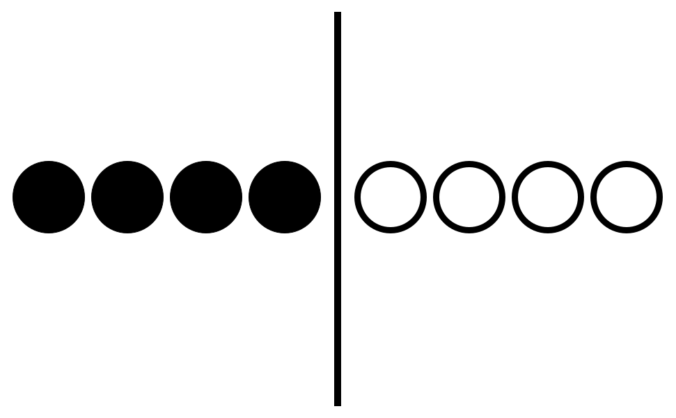

Allen Carr's method is the answer, and willpower is weak.

What finally made Allen Carr's method click for me is the analogy he made in his [bbc interview](https://youtu.be/0TL2Vh7goJc?si=FMdCuWvqB0yFxElq). I'm going to try to explain his idea in my own way, but I highly encourage you to check out his actual video.

---

Humans really like to see the world in black and white. It is the easiest thing to do. It is the natural thing to do.

As soon as black and white turn to gray, all hell breaks lose. 

Hell, even black and white on the same screen has that same effect.

We know this from the movies. From stories. From characters. A lot of good stories nowadays are written in a way so that the villain has human traits. Has their own beliefs that they're fighting for. Most of the time, we can believe that given different circumstances, the villain could've acted for the good of society. We can come to an understanding about their actions. That there is some good in their heart.

Even for personal dilemmas, we sometimes make a list of pros and cons, and then we make a cost-benefit analysis, and then we choose the course of actions has the set of pros and cons that we're most okay with. 

But these two lines of thinking are exactly the trap of pornography. These two lines of thinking keep us addicted. For in portraying pornography, or smoking, or whatever kind of addiction, as a list of pros and cons, the mind starts to think of the choice as a simple question: *short term pain for long term gain, or short term gain*? And in the process of answering this question, there will always exist humans, and as you yourself reading this is deeply human, that will sometimes pick short term gain. 

Allen Carr's method, applied to pornography, is to convince yourself that there are only negative consequences for pleasuring oneself using pornography. To see only black. To present the argument as, would you rather have 0 dollars *now*, or 100 *now*? To present not using pornography as not a heroic choice or sacrifice in light of pros and cons, but as the most natural, the only, and the easiest course of action. 

I'd like to take this moment again to visualize Allen Carr's argument in his [bbc video](https://youtu.be/0TL2Vh7goJc?si=FMdCuWvqB0yFxElq) here: 

Before applying the easy method:

After applying the easy method:

Basically, so long as **one single white chip remains** on the positive side, you might always understand if someone chooses to indulge in their addiction, and thus you will always expend willpower to choose sobriety. But willpower is weak, and chances are, you will eventually fail.  

So here's the method, if you really want to see pornography for what it is for good: make a list of all the positives of using pornography. Don't let shame hold you back, don't mistrust your own rationality as you have in the past for being stuck in the seemingly irrational loop of using poronography. Then, your onus is, for every positive you listed, convince yourself that, not only does the positive feature not exist, it is actually negative.

When I first wrote down a list of my positives for using pornography, I was surprised at how long it was. At how many things I was subconsciously considering. I was daunted, at how many pros there were. What I would be *losing* should I give up pornography forever. But slowly but surely (admittedly with a lot of running away and despair at first), I was able to convince myself that each and every positive I listed was actually a negative. I think pornography differs slightly from smoking in this aspect, because there are a different set of obvious and non-obvious positives and different chains of reasoning that might lead you to consider one good than the other.

Some say that this is self-hypnosis, that this is the folly of reason, that reason following belief is madness. But I think it's beautiful, and necessary. I think, as Allen Carr writes in his books, that no smoker, or drug user, or pornography addict, truly wants to keep on using deep down. Guided by that belief, the easy way is like a mathematical proof where your intuition guides your reason, where in trying to reach the destination you find new chains of thought that you otherwise would never have thought of before.  

The full list of my own original positives is too long to go into depth in this article, but I'll list the most obvious one here and refute it. I plan to create a full list and make multiple articles refuting them in the coming weeks, but I think that reading Allen Carr's books or letting your own reason guide you can be a great start to writing your own list.

---

The top point you might make is pleasure. You might believe that using pornography gives you great pleasure, and that by giving up pornography, you are giving up pleasure (framing things as "what you are giving up if you give up pornography" can really elucidate your reasoning for why you believe something is positive).

My own refutation follows in the footsteps of Allen Carr's refutation to smoking. In believing that pleasuring yourself to pornography gives you pleasure, it is obvious that the rest of the time in which you are not using pornography is dull, grey, and miserable. So in the case which you believe smoking to grant pleasure and not using it, your life is objectively less pleasureable as a whole. But even in the case that you are pleasuring yourself while using pornography, the spike in pleasure you feel, is actually the pleasure that you have witheld from yourself, that you would experience in every moment of regular life. Thus, by being addicted to pornography, you experience objectively less pleasure all of the time. So there is no pleasure to be gained from using pornography.

The nuance of this point may go a little bit deeper for pornography's case as compared to smoking, the most obvious argument being that positive pleasure is experienced whilst having sex, so it makes sense to believe that pornography also grants positive pleasure, which I refute by saying that the onus of sex is procreation, and any other pleasure is a lie, and so on, but that can be discussed more in my later articles.

Thank you for reading this. I want to write to you, dear reader, to tell you that you are not crazy. That there is a way out of this addiction, to be free from it forever. Where no sacrifices have to be made. I wish you the best of luck. 
